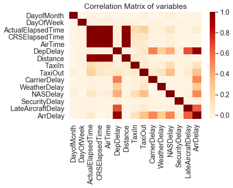
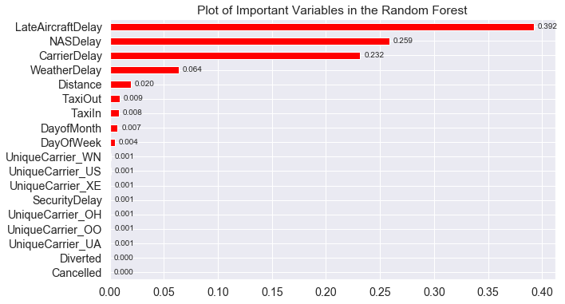

# Predicting Arrival Times for Denver airport using Random Forests and Naive Bayes
Correlation Matrix of the variables in the dataset:  

__Models Tried:__
* Random Forest Regressor
* Random Forest Classifier
* Naive Bayes Gaussian Classifier

__Random Forest Models:__  
Significance of the variables in predicting the Arrival Delay as identified by the Random Forest model:  

__Hyper-Parameter Tuning:__
The following are the Random Forest Parameters that we care going to experiment with to find the best parameters.
* __n_estimators__ = number of trees in the forest 
* __max_features__ = max number of features considered for splitting a node 
* __max_depth__ = max number of levels in each decision tree 
* __min_samples_split__ = min number of data points placed in a node before the node is split 
* __min_samples_leaf__ = min number of data points allowed in a leaf node 
* __bootstrap__ = method for sampling data points (with or without replacement) 

__***Best Parameters:***__
* n_estimators : 400
* min_samples_split : 10
* min_samples_leaf : 1
* max_features : 'auto'
* max_depth : 20
* bootstrap : True
 
__ArrDelay categories for Random Forest Classifier Model:__
* Less than -30 minutes : Very Early
* Less than 0 minutes & Greater than or equal to -30 minutes : Early
* 0 minutes to 5 minutes : Ontime
* 5 minutes to 30 minutes : Late
* Greater than 30 minutes : Very late.

__Conclusion:__  
The accuracy of our Random Forest Classification is 81% while our Naive Bayes Classification is only 70%. We were able to generate the best Random Forest Classifier by hyper-parameter tuning. However we did could not do hyper-parameter tuning on the Naive Bayes classifier as it is so naive that it doesn't accept parameters except priors which we don't know.
